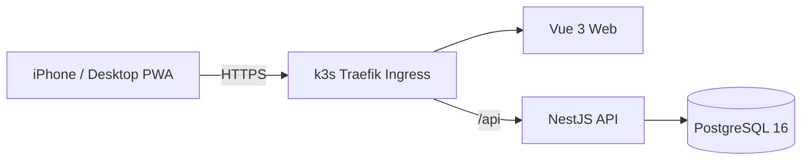

# Speaking Core 1350

영어 회화 학습(문장 청크, 구동사, 핵심 단어, 비즈니스 영어) 1,350개 항목을 서버 기반 진도 동기화와 함께 학습하는 모바일 우선 PWA입니다. PC와 스마트폰에서 동일한 Google 계정으로 로그인해 학습 상태를 공유합니다.

> **현재 상태: Phase 2 완료 + Chunk 스피킹 드릴 추가** — 모노레포/DB/Google OAuth 인증/Seed(Phase 1)에 이어 SRS v1 복습 스케줄러, 오늘의 30개/복습/신규/취약 큐, 학습 세션·리뷰 API, 진행률 요약/캘린더, 카드형 학습 UI, 카테고리·검색 브라우징(무한 스크롤)까지 구현되어 있습니다(Phase 2). 여기에 더해, SRS 복습과는 별개로 고빈도 스피킹 Chunk를 쉐도잉으로 반복 연습하는 "Chunk 스피킹 드릴" 메뉴가 추가되었습니다. 자세한 범위는 `CLAUDE.md`, `docs/IMPLEMENTATION_SPEC.md`, `docs/API_CONTRACT.md` 참고.

## Architecture



프로덕션은 k3s 클러스터 위에서 돌아갑니다 (`k3s/` 참고). 프론트엔드와 백엔드가 같은 도메인을 사용하며(`/` → Vue, `/api/*` → NestJS), k3s에 기본 포함된 Traefik이 이 라우팅과 cert-manager 기반 자동 HTTPS를 처리합니다. Google OAuth Callback도 같은 도메인 하위(`/api/auth/google/callback`)에서 처리되어 CORS/쿠키/Redirect URI 구성이 단순해집니다.

인증은 **Google OAuth 2.0 / OpenID Connect만** 지원합니다. 자체 회원가입, 이메일/비밀번호 로그인은 존재하지 않습니다. 로그인 성공 시 백엔드가 Secure/HttpOnly/SameSite 쿠키에 서명된 세션 토큰을 발급하며, 프론트엔드 JavaScript는 이 토큰에 접근하지 않습니다.

## Directory Structure

```text
english-core-speaking/
├─ apps/
│  ├─ web/            # Vue 3 + Vite + PWA
│  │  └─ src/{api,components,composables,router,stores,views}
│  └─ api/             # NestJS
│     └─ src/{auth,users,learning-items,study,progress,chunk-drill,health,prisma,common}
├─ prisma/
│  ├─ schema.prisma    # 실제 사용되는 스키마 (database/schema.prisma와 동기화)
│  └─ seed.ts           # deterministic upsert 기반 seed 스크립트 (canonical seed + chunk drill 데이터셋)
├─ database/schema.prisma   # 최초 계약서(리뷰용 기준 문서)
├─ data/                # Canonical seed (1,350개 항목, 임의 수정 금지) + chunk_drill_v1.json(별도 보조 데이터셋)
├─ k3s/                  # 프로덕션 배포 매니페스트 (k3s + Traefik + cert-manager, 자세한 건 k3s/README.md)
├─ docker-compose.dev.yml   # 로컬 개발용 PostgreSQL만 기동
├─ scripts/              # seed 검증, PWA 아이콘 생성 스크립트
└─ docs/                 # 제품/기술 명세, API 계약
```

## Requirements

- Node.js 20+
- pnpm 9+ (`corepack enable` 권장)
- Docker Desktop (로컬 PostgreSQL 및 프로덕션 이미지 빌드용)
- Google Cloud 프로젝트 (OAuth 클라이언트) — 실제 로그인 테스트 시 필요

## Local 실행 방법

### 1. 의존성 설치

```bash
pnpm install
```

### 2. 환경변수 설정

```bash
cp .env.example .env
```

`.env`를 열어 최소한 아래 값을 채웁니다.

- `POSTGRES_PASSWORD` — 임의의 로컬 비밀번호
- `SESSION_SECRET` — `openssl rand -base64 48` 로 생성
- `GOOGLE_CLIENT_ID`, `GOOGLE_CLIENT_SECRET`, `GOOGLE_CALLBACK_URL` — [Google OAuth 설정](#google-oauth-설정-방법) 참고. 실제 로그인 테스트를 하지 않는다면 임의의 placeholder 값으로도 서버는 기동됩니다(단, 실제 Google 로그인은 동작하지 않습니다).

로컬에서 PostgreSQL을 5432가 아닌 다른 포트로 띄운다면(`docker-compose.dev.yml` 기본값은 `5433`), `DATABASE_URL`의 포트도 맞춰줍니다.

### 3. Database 실행

```bash
docker compose -f docker-compose.dev.yml up -d
```

PostgreSQL 16 컨테이너가 `localhost:5433`에 뜹니다 (호스트에 이미 5432를 쓰는 다른 서비스가 있을 수 있어 기본 포트를 피했습니다. 비어있다면 5432로 바꿔도 무방합니다).

### 4. Migration 실행

```bash
pnpm prisma:generate
pnpm prisma:migrate --name init
```

### 5. Seed 실행 (선택)

```bash
pnpm seed
```

`data/speaking_core_1350_seed_v2.json`의 1,350개 항목과 `data/chunk_drill_v1.json`의 Chunk 스피킹 드릴 100개 항목을 각각 `id` 기준 upsert로 적재합니다. 여러 번 실행해도 중복되지 않습니다(idempotent). API 서버 자체도 기동할 때마다 동일한 로직으로 자동 시딩하므로(`apps/api/src/prisma/seed.service.ts`), 다음 단계에서 `pnpm dev:api`를 실행하면 이 단계 없이도 데이터가 채워집니다 — 서버를 띄우지 않고 바로 시드만 넣고 싶을 때 쓰는 명령입니다.

검증:

```bash
pnpm seed:validate   # scripts/validate_seed.py — 로컬에 Python이 설치되어 있어야 합니다
```

### 6. Backend 실행

```bash
pnpm dev:api
```

`http://localhost:3000/api/health` 로 헬스체크를 확인합니다.

### 7. Frontend 실행

```bash
pnpm dev:web
```

`http://localhost:5173` 접속. Vite dev server가 `/api/*` 요청을 `http://localhost:3000`으로 프록시합니다.

## Google OAuth 설정 방법

### Google Cloud Console 설정

1. https://console.cloud.google.com/ 접속 → 프로젝트 선택(또는 새로 생성)
2. **APIs & Services > OAuth consent screen**
   - User Type: External (개인 프로젝트라면 Testing 모드로 충분)
   - 앱 이름, 지원 이메일 등 필수 항목 입력
3. **APIs & Services > Credentials > Create Credentials > OAuth client ID**
   - Application type: **Web application**
   - **Authorized JavaScript origins**
     - 로컬: `http://localhost:5173`
     - 운영: `https://<your-domain>`
   - **Authorized redirect URIs**
     - 로컬: `http://localhost:3000/api/auth/google/callback`
     - 운영: `https://<your-domain>/api/auth/google/callback`
4. 생성된 **Client ID**, **Client Secret**을 `.env`의 `GOOGLE_CLIENT_ID`, `GOOGLE_CLIENT_SECRET`에 입력
5. `GOOGLE_CALLBACK_URL`을 3번에서 등록한 Redirect URI와 **정확히 동일하게** 설정

### 로그인 흐름

1. 프론트엔드에서 "Google로 로그인" 클릭 → `GET /api/auth/google`로 이동
2. 백엔드(Passport `google-oauth20`)가 Google 동의 화면으로 리다이렉트
3. 사용자가 Google 계정으로 인증
4. Google이 `GET /api/auth/google/callback`으로 결과를 반환 → 백엔드가 서버 간 통신으로 검증(프론트엔드는 어떤 토큰도 다루지 않음)
5. Google `sub` 기준으로 사용자 조회, 없으면 생성
6. 서명된 세션 토큰을 Secure/HttpOnly/SameSite 쿠키로 발급 → `FRONTEND_ORIGIN`으로 리다이렉트
7. 이후 요청은 쿠키로 인증 (`GET /api/auth/me`로 현재 사용자 확인)
8. 로그아웃: `POST /api/auth/logout` (쿠키 제거)

## 환경변수 설정

`.env.example` 참고. Production Credential은 절대 Git에 커밋하지 않습니다.

| 변수 | 설명 |
| --- | --- |
| `POSTGRES_DB`/`POSTGRES_USER`/`POSTGRES_PASSWORD` | PostgreSQL 접속 정보 |
| `DATABASE_URL` | Prisma 접속 문자열 |
| `GOOGLE_CLIENT_ID`/`GOOGLE_CLIENT_SECRET` | Google OAuth 클라이언트 정보 |
| `GOOGLE_CALLBACK_URL` | Google Console에 등록한 Redirect URI와 일치해야 함 |
| `SESSION_SECRET` | 세션 쿠키 서명용 비밀키 |
| `FRONTEND_ORIGIN` | CORS 허용 origin이자 로그인 성공 후 리다이렉트 대상 |
| `VITE_API_BASE_URL` | 프론트엔드가 호출할 API base path |

## Test 실행

```bash
pnpm test:api    # 단위 테스트 (DB 불필요)
pnpm test:web    # Vitest 단위 테스트

# e2e (로컬 PostgreSQL이 떠 있고 migrate/seed가 끝난 상태에서)
cd apps/api && npx jest --config ./test/jest-e2e.json
```

`test:api`의 e2e 스위트는 `/api/health`, 인증 Guard가 비인증 요청을 401로 차단하는지, `/api/auth/google`이 Google 동의 화면으로 리다이렉트하는지 검증합니다(더미 Client ID로도 리다이렉트 자체는 발급되며, 실제 Google 서버 호출은 발생하지 않습니다). `study.e2e-spec.ts`는 세션 생성 → 리뷰 제출 → 복습 큐 반영 → 진행률/캘린더 갱신까지 실제 Google 로그인 없이 throwaway 테스트 사용자로 검증합니다.

## Production Build

```bash
pnpm build          # api + web 순서로 빌드
pnpm typecheck       # tsc / vue-tsc
```

## Docker 실행 방법 (로컬 개발용 PostgreSQL만)

```bash
docker compose -f docker-compose.dev.yml up -d
```

프로덕션은 더 이상 Docker Compose로 띄우지 않습니다 (Caddy 기반 스택은 k3s로 이전되어 제거됨).

## k3s 배포 (Production)

프로덕션은 k3s 클러스터에서 돌아갑니다. k3s 기본 포함 Traefik이 Caddy를 대신해 `/`→Vue, `/api/*`→NestJS 라우팅을 맡고, cert-manager가 `cleanbrain.me`의 Let's Encrypt 인증서를 자동 발급/갱신합니다. 이미지는 GitHub Container Registry(`ghcr.io/cleanbrain-developer`)에 push해서 클러스터가 pull합니다.

전체 순서(이미지 빌드/push, 클러스터 시크릿·ClusterIssuer 준비, `kubectl apply`)는 **[`k3s/README.md`](k3s/README.md)**에 정리되어 있습니다. 매니페스트는 `k3s/*.yaml`, 실제 값을 채워 넣는 시크릿/ClusterIssuer는 `*.example.yaml`을 복사해서 씁니다(둘 다 gitignore 처리되어 있어 실수로 커밋되지 않음). 기존 Docker Compose 배포의 데이터는 이관하지 않고 새 클러스터에서 새로 시작합니다.

api 컨테이너는 기동할 때마다(최초 설치/재배포/재시작 모두) 스스로 `prisma migrate deploy`를 실행한 뒤 시드 데이터를 주입합니다(`apps/api/src/prisma/seed.service.ts`) — 별도의 마이그레이션/시드 단계가 필요 없습니다.

## Backup

PostgreSQL 데이터는 k3s의 `postgres` StatefulSet이 쓰는 PVC에 저장됩니다. 백업 예시:

```bash
kubectl -n speaking-core exec statefulset/postgres -- \
  pg_dump -U "$POSTGRES_USER" "$POSTGRES_DB" > backup_$(date +%Y%m%d).sql
```

## Study 기능 (Phase 2)

- **오늘의 30개 / 복습 / 신규 / 취약 항목**: 홈 화면의 모드 카드에서 진입 (`GET /api/study/{daily,due,new,weak}`)
- **카테고리 브라우징 / 검색 / 랜덤 학습**: `/browse` — 카테고리 필터, 한/영 검색, 무한 스크롤, "뜻 가리기" 토글, 순서대로/랜덤 학습 시작
- **스피킹 학습 모드 v1**: 카드에서 타이핑으로 회상 후 "정답 확인"으로 뜻/예문 노출 (마이크 인식은 Phase 3 검토 대상)
- **영어 발음 듣기**: 브라우저 `SpeechSynthesis` API
- **난이도 평가 4단계**: 다시(1)/어려움(2)/보통(3)/쉬움(4) → 서버의 SRS v1 스케줄러(`apps/api/src/study/scheduler/`)가 다음 복습일 계산. 알고리즘 교체를 위해 `REVIEW_SCHEDULER` DI 토큰으로 분리되어 있음
- **진행률 요약**: 홈 화면 상단 (전체/학습함/복습 대상/오늘 학습)

## Chunk 스피킹 드릴

SRS 기반 암기 복습(위 Study 기능)과는 별개의 메뉴입니다. 목적이 "기억"이 아니라 "산출 자동화"이기 때문에 서버가 다음 복습일을 계산하는 스케줄러 없이, 단순 반복/커버리지 기반으로 동작합니다.

- **콘텐츠**: `data/chunk_drill_v1.json` — 회화에서 자주 쓰이는 스피킹 Chunk(담화 표지, 의견/완곡 표현, 동의·반대, 되묻기, 이야기 연결어, 스몰토크, 부탁/제안, 강조, 비교 등) 100개. 학습 콘텐츠 원칙(`CLAUDE.md`)에 따라 canonical seed(`speaking_core_1350_seed_v2.json`)와는 완전히 분리된 독립 데이터셋이며, 실제 코퍼스 빈도가 아니라 정립된 formulaic-sequence/담화표지 연구에 기반해 큐레이션한 순위입니다(자세한 한계는 `data/chunk_drill_v1_manifest.json`의 `note` 참고). v2에서 빈도 코퍼스를 반영해 확장할 수 있습니다.
- **연습 방식**: 홈 화면의 별도 카드(🗣️ Chunk 스피킹 드릴)로 진입 → `GET /api/chunk-drill/set`으로 아직 안 다룬 항목을 우선(그다음 가장 오래 전에 연습한 항목 우선)으로 세트를 받아 카드 하나씩 진행. 카드가 뜨면 브라우저 `SpeechSynthesis`로 자동 반복 재생(1/3/5회 선택)되어 바로 따라 말하고, "다음"을 눌러 넘어갑니다. 세트를 다 돌면 `POST /api/chunk-drill/complete`로 완료 기록.
- **진행 기록**: `ChunkDrillProgress`(사용자별 `practiceCount`/`lastPracticedAt`)만 저장하는 경량 모델이며, `LearningProgress`/SRS 스케줄러와는 완전히 독립적입니다. 홈 화면에 "N/100 연습함 · 오늘 M개" 요약이 표시됩니다(`GET /api/chunk-drill/summary`).

## 남은 작업 (Phase 3 후보)

- 로그인 상태를 유지한 Playwright 등 자동화된 E2E UI 테스트
- 마이크 기반 발음 인식 스피킹 모드
- Progress 캘린더 시각화 UI (API는 구현됨: `GET /api/progress/calendar`)
- PWA 오프라인 학습 진도 동기화
- Chunk 스피킹 드릴 데이터셋을 실제 코퍼스 빈도 기반으로 확장 (v2)
