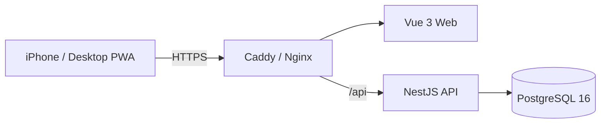

# Speaking Core 1350

영어 회화 학습(문장 청크, 구동사, 핵심 단어, 비즈니스 영어) 1,350개 항목을 서버 기반 진도 동기화와 함께 학습하는 모바일 우선 PWA입니다. PC와 스마트폰에서 동일한 Google 계정으로 로그인해 학습 상태를 공유합니다.

> **현재 상태: Phase 2 완료** — 모노레포/DB/Google OAuth 인증/Seed(Phase 1)에 이어 SRS v1 복습 스케줄러, 오늘의 30개/복습/신규/취약 큐, 학습 세션·리뷰 API, 진행률 요약/캘린더, 카드형 학습 UI, 카테고리·검색 브라우징(무한 스크롤)까지 구현되어 있습니다. 자세한 범위는 `CLAUDE.md`, `docs/IMPLEMENTATION_SPEC.md`, `docs/API_CONTRACT.md` 참고.

## Architecture



프로덕션에서는 프론트엔드와 백엔드가 같은 도메인을 사용합니다 (`/` → Vue, `/api/*` → NestJS). Google OAuth Callback도 같은 도메인 하위(`/api/auth/google/callback`)에서 처리되어 CORS/쿠키/Redirect URI 구성이 단순해집니다.

인증은 **Google OAuth 2.0 / OpenID Connect만** 지원합니다. 자체 회원가입, 이메일/비밀번호 로그인은 존재하지 않습니다. 로그인 성공 시 백엔드가 Secure/HttpOnly/SameSite 쿠키에 서명된 세션 토큰을 발급하며, 프론트엔드 JavaScript는 이 토큰에 접근하지 않습니다.

## Directory Structure

```text
english-core-speaking/
├─ apps/
│  ├─ web/            # Vue 3 + Vite + PWA
│  │  └─ src/{api,components,composables,router,stores,views}
│  └─ api/             # NestJS
│     └─ src/{auth,users,learning-items,health,prisma,common}
├─ prisma/
│  ├─ schema.prisma    # 실제 사용되는 스키마 (database/schema.prisma와 동기화)
│  └─ seed.ts           # deterministic upsert 기반 seed 스크립트
├─ database/schema.prisma   # 최초 계약서(리뷰용 기준 문서)
├─ data/                # Canonical seed (1,350개 항목) — 임의 수정 금지
├─ deploy/               # 프로덕션 Docker Compose, Caddyfile
├─ docker-compose.dev.yml   # 로컬 개발용 PostgreSQL만 기동
├─ scripts/              # seed 검증, PWA 아이콘 생성 스크립트
└─ docs/                 # 제품/기술 명세, API 계약
```

## Requirements

- Node.js 20+
- pnpm 9+ (`corepack enable` 권장)
- Docker Desktop (PostgreSQL 및 프로덕션 이미지 실행용)
- Google Cloud 프로젝트 (OAuth 클라이언트) — 실제 로그인 테스트 시 필요

## Local 실행 방법

### 1. 의존성 설치

```bash
pnpm install
```

### 2. 환경변수 설정

```bash
cp .env.example .env
```

`.env`를 열어 최소한 아래 값을 채웁니다.

- `POSTGRES_PASSWORD` — 임의의 로컬 비밀번호
- `SESSION_SECRET` — `openssl rand -base64 48` 로 생성
- `GOOGLE_CLIENT_ID`, `GOOGLE_CLIENT_SECRET`, `GOOGLE_CALLBACK_URL` — [Google OAuth 설정](#google-oauth-설정-방법) 참고. 실제 로그인 테스트를 하지 않는다면 임의의 placeholder 값으로도 서버는 기동됩니다(단, 실제 Google 로그인은 동작하지 않습니다).

로컬에서 PostgreSQL을 5432가 아닌 다른 포트로 띄운다면(`docker-compose.dev.yml` 기본값은 `5433`), `DATABASE_URL`의 포트도 맞춰줍니다.

### 3. Database 실행

```bash
docker compose -f docker-compose.dev.yml up -d
```

PostgreSQL 16 컨테이너가 `localhost:5433`에 뜹니다 (호스트에 이미 5432를 쓰는 다른 서비스가 있을 수 있어 기본 포트를 피했습니다. 비어있다면 5432로 바꿔도 무방합니다).

### 4. Migration 실행

```bash
pnpm prisma:generate
pnpm prisma:migrate --name init
```

### 5. Seed 실행

```bash
pnpm seed
```

`data/speaking_core_1350_seed_v2.json`의 1,350개 항목을 `id` 기준 upsert로 적재합니다. 여러 번 실행해도 중복되지 않습니다(idempotent).

검증:

```bash
pnpm seed:validate   # scripts/validate_seed.py — 로컬에 Python이 설치되어 있어야 합니다
```

### 6. Backend 실행

```bash
pnpm dev:api
```

`http://localhost:3000/api/health` 로 헬스체크를 확인합니다.

### 7. Frontend 실행

```bash
pnpm dev:web
```

`http://localhost:5173` 접속. Vite dev server가 `/api/*` 요청을 `http://localhost:3000`으로 프록시합니다.

## Google OAuth 설정 방법

### Google Cloud Console 설정

1. https://console.cloud.google.com/ 접속 → 프로젝트 선택(또는 새로 생성)
2. **APIs & Services > OAuth consent screen**
   - User Type: External (개인 프로젝트라면 Testing 모드로 충분)
   - 앱 이름, 지원 이메일 등 필수 항목 입력
3. **APIs & Services > Credentials > Create Credentials > OAuth client ID**
   - Application type: **Web application**
   - **Authorized JavaScript origins**
     - 로컬: `http://localhost:5173`
     - 운영: `https://<your-domain>`
   - **Authorized redirect URIs**
     - 로컬: `http://localhost:3000/api/auth/google/callback`
     - 운영: `https://<your-domain>/api/auth/google/callback`
4. 생성된 **Client ID**, **Client Secret**을 `.env`의 `GOOGLE_CLIENT_ID`, `GOOGLE_CLIENT_SECRET`에 입력
5. `GOOGLE_CALLBACK_URL`을 3번에서 등록한 Redirect URI와 **정확히 동일하게** 설정

### 로그인 흐름

1. 프론트엔드에서 "Google로 로그인" 클릭 → `GET /api/auth/google`로 이동
2. 백엔드(Passport `google-oauth20`)가 Google 동의 화면으로 리다이렉트
3. 사용자가 Google 계정으로 인증
4. Google이 `GET /api/auth/google/callback`으로 결과를 반환 → 백엔드가 서버 간 통신으로 검증(프론트엔드는 어떤 토큰도 다루지 않음)
5. Google `sub` 기준으로 사용자 조회, 없으면 생성
6. 서명된 세션 토큰을 Secure/HttpOnly/SameSite 쿠키로 발급 → `FRONTEND_ORIGIN`으로 리다이렉트
7. 이후 요청은 쿠키로 인증 (`GET /api/auth/me`로 현재 사용자 확인)
8. 로그아웃: `POST /api/auth/logout` (쿠키 제거)

## 환경변수 설정

`.env.example` 참고. Production Credential은 절대 Git에 커밋하지 않습니다.

| 변수 | 설명 |
| --- | --- |
| `POSTGRES_DB`/`POSTGRES_USER`/`POSTGRES_PASSWORD` | PostgreSQL 접속 정보 |
| `DATABASE_URL` | Prisma 접속 문자열 |
| `GOOGLE_CLIENT_ID`/`GOOGLE_CLIENT_SECRET` | Google OAuth 클라이언트 정보 |
| `GOOGLE_CALLBACK_URL` | Google Console에 등록한 Redirect URI와 일치해야 함 |
| `SESSION_SECRET` | 세션 쿠키 서명용 비밀키 |
| `FRONTEND_ORIGIN` | CORS 허용 origin이자 로그인 성공 후 리다이렉트 대상 |
| `VITE_API_BASE_URL` | 프론트엔드가 호출할 API base path |

## Test 실행

```bash
pnpm test:api    # 단위 테스트 (DB 불필요)
pnpm test:web    # Vitest 단위 테스트

# e2e (로컬 PostgreSQL이 떠 있고 migrate/seed가 끝난 상태에서)
cd apps/api && npx jest --config ./test/jest-e2e.json
```

`test:api`의 e2e 스위트는 `/api/health`, 인증 Guard가 비인증 요청을 401로 차단하는지, `/api/auth/google`이 Google 동의 화면으로 리다이렉트하는지 검증합니다(더미 Client ID로도 리다이렉트 자체는 발급되며, 실제 Google 서버 호출은 발생하지 않습니다). `study.e2e-spec.ts`는 세션 생성 → 리뷰 제출 → 복습 큐 반영 → 진행률/캘린더 갱신까지 실제 Google 로그인 없이 throwaway 테스트 사용자로 검증합니다.

## Production Build

```bash
pnpm build          # api + web 순서로 빌드
pnpm typecheck       # tsc / vue-tsc
```

## Docker 실행 방법

### 로컬 개발용 (PostgreSQL만)

```bash
docker compose -f docker-compose.dev.yml up -d
```

### 프로덕션 스택 (PostgreSQL + API + Web + Caddy)

```bash
docker compose --env-file .env -f deploy/docker-compose.prod.yml up -d --build
```

> `docker compose`의 프로젝트 디렉터리는 기본적으로 첫 번째 `-f`로 지정한 파일이 위치한 디렉터리(`deploy/`)를 기준으로 하므로, 저장소 루트의 `.env`를 사용하려면 반드시 `--env-file .env`를 함께 지정합니다.

최초 기동 후 마이그레이션과 seed를 컨테이너 네트워크 안에서 실행합니다.

```bash
docker compose --env-file .env -f deploy/docker-compose.prod.yml exec api \
  node_modules/.bin/prisma migrate deploy --schema ../../prisma/schema.prisma
```

Caddy는 `deploy/Caddyfile.example`을 `deploy/Caddyfile`로 복사한 뒤 도메인을 실제 값으로 바꿔 사용합니다(운영 환경에는 실제 도메인과 HTTPS 인증서 발급이 필요하므로 로컬에서는 `caddy` 서비스 없이 `postgres`/`api`/`web`만 띄워 검증하는 것을 권장합니다).

## Hetzner 배포 (Production)

아래 순서대로 진행합니다. 모든 명령어는 서버에 SSH로 접속한 뒤(별도 표기가 없으면) 실행합니다.

### 1. 서버 준비
- Hetzner Cloud Console에서 서버 생성 (Ubuntu 22.04+, 최소 2vCPU/4GB 권장), SSH 키 등록
- 도메인 DNS의 A(및 필요 시 AAAA) 레코드를 서버 공인 IP로 지정
- 방화벽: 22(SSH), 80, 443만 허용
  ```bash
  ufw allow 22/tcp && ufw allow 80/tcp && ufw allow 443/tcp && ufw enable
  ```

### 2. Docker 설치
```bash
curl -fsSL https://get.docker.com | sh
```

### 3. 저장소 배포
```bash
git clone https://github.com/cleanbrain-developer/english-core-speaking.git
cd english-core-speaking
```
이미 배포된 서버를 업데이트할 때는 `git pull`만 실행하면 됩니다(아래 6단계부터 반복).

### 4. 환경변수 설정
```bash
cp .env.example .env
nano .env   # 또는 vi
```
로컬 개발과 다르게 채워야 하는 값:
- `POSTGRES_PASSWORD` — 강력한 랜덤 값
- `SESSION_SECRET` — `openssl rand -base64 48`
- `GOOGLE_CLIENT_ID`/`GOOGLE_CLIENT_SECRET` — 프로덕션용 Google OAuth Credential (5단계에서 발급/등록)
- `GOOGLE_CALLBACK_URL=https://<도메인>/api/auth/google/callback`
- `FRONTEND_ORIGIN=https://<도메인>`
- `NODE_ENV=production`

### 5. Google Cloud Console에 프로덕션 값 등록
기존 OAuth Client(또는 프로덕션용으로 새로 생성한 Client)의 **Credentials** 설정에 추가:
- Authorized JavaScript origins: `https://<도메인>`
- Authorized redirect URIs: `https://<도메인>/api/auth/google/callback`

### 6. Caddyfile 준비
```bash
cp deploy/Caddyfile.example deploy/Caddyfile
nano deploy/Caddyfile   # 첫 줄의 도메인을 실제 도메인으로 교체
```
Caddy가 Let's Encrypt로 HTTPS 인증서를 자동 발급/갱신하므로 별도 인증서 작업은 필요 없습니다(80/443이 해당 도메인으로 실제 접근 가능해야 발급됩니다).

### 7. 빌드 및 기동
```bash
docker compose --env-file .env -f deploy/docker-compose.prod.yml up -d --build
docker compose --env-file .env -f deploy/docker-compose.prod.yml ps
```

### 8. Migration 실행
```bash
docker compose --env-file .env -f deploy/docker-compose.prod.yml exec api \
  node_modules/.bin/prisma migrate deploy --schema ../../prisma/schema.prisma
```

### 9. Seed 실행 (최초 1회)
프로덕션 이미지에는 seed 실행에 필요한 `tsx`가 포함돼 있지 않으므로, SSH 터널로 로컬 `pnpm seed`를 원격 DB에 실행합니다.
```bash
# 로컬 머신에서: 서버의 5432를 로컬 15432로 터널링
ssh -N -L 15432:localhost:5432 <user>@<서버IP>
```
```bash
# 별도 터미널(로컬, 저장소 루트)에서
DATABASE_URL="postgresql://speaking_core:<POSTGRES_PASSWORD>@localhost:15432/speaking_core?schema=public" pnpm seed
```

### 10. 동작 확인
```bash
curl https://<도메인>/api/health
```
브라우저로 `https://<도메인>` 접속 → Google 로그인 → 오늘의 30개 등이 정상 동작하는지 확인합니다.

### 11. 로그 / 재기동 / 업데이트 배포
```bash
docker compose --env-file .env -f deploy/docker-compose.prod.yml logs -f api
docker compose --env-file .env -f deploy/docker-compose.prod.yml restart api

# 코드 업데이트 배포
git pull
docker compose --env-file .env -f deploy/docker-compose.prod.yml up -d --build
docker compose --env-file .env -f deploy/docker-compose.prod.yml exec api \
  node_modules/.bin/prisma migrate deploy --schema ../../prisma/schema.prisma
```

## Backup

PostgreSQL 데이터는 named volume(`speaking_core_pg`)에 저장됩니다. 백업 예시:

```bash
docker compose --env-file .env -f deploy/docker-compose.prod.yml exec postgres \
  pg_dump -U "$POSTGRES_USER" "$POSTGRES_DB" > backup_$(date +%Y%m%d).sql
```

## Study 기능 (Phase 2)

- **오늘의 30개 / 복습 / 신규 / 취약 항목**: 홈 화면의 모드 카드에서 진입 (`GET /api/study/{daily,due,new,weak}`)
- **카테고리 브라우징 / 검색 / 랜덤 학습**: `/browse` — 카테고리 필터, 한/영 검색, 무한 스크롤, "뜻 가리기" 토글, 순서대로/랜덤 학습 시작
- **스피킹 학습 모드 v1**: 카드에서 타이핑으로 회상 후 "정답 확인"으로 뜻/예문 노출 (마이크 인식은 Phase 3 검토 대상)
- **영어 발음 듣기**: 브라우저 `SpeechSynthesis` API
- **난이도 평가 4단계**: 다시(1)/어려움(2)/보통(3)/쉬움(4) → 서버의 SRS v1 스케줄러(`apps/api/src/study/scheduler/`)가 다음 복습일 계산. 알고리즘 교체를 위해 `REVIEW_SCHEDULER` DI 토큰으로 분리되어 있음
- **진행률 요약**: 홈 화면 상단 (전체/학습함/복습 대상/오늘 학습)

## 남은 작업 (Phase 3 후보)

- 로그인 상태를 유지한 Playwright 등 자동화된 E2E UI 테스트
- 마이크 기반 발음 인식 스피킹 모드
- Progress 캘린더 시각화 UI (API는 구현됨: `GET /api/progress/calendar`)
- PWA 오프라인 학습 진도 동기화
