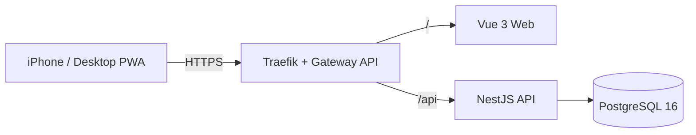

# Speaking Core 1350

A mobile-first PWA for practicing English speaking through 1,350 curated items across four categories (conversation chunks, phrasal verbs, core words, business English), with server-side progress sync so a learner's queue stays consistent across phone and desktop.

**Production:** [english-core-speaking.cleanbrain.me](https://english-core-speaking.cleanbrain.me)

## Status

Core product is implemented and running in production: the monorepo scaffold, Google OAuth session auth, deterministic seed import, an SRS-based review scheduler (daily/due/new/weak queues), study sessions and progress tracking, and a separate "Chunk Speaking Drill" mode for shadowing high-frequency spoken chunks outside the SRS loop. See `CLAUDE.md`, `docs/IMPLEMENTATION_SPEC.md`, and `docs/API_CONTRACT.md` for the full spec.

## Architecture



Web and API are served from the same domain (`/` → Vue, `/api/*` → NestJS), which keeps CORS, cookies, and the OAuth redirect URI simple — there's no separate API subdomain to configure. In production this routing is handled by Traefik's Kubernetes Gateway API support, with cert-manager issuing and renewing the TLS certificate automatically. Kubernetes manifests for the actual cluster live in a separate infrastructure repository, [`cleanbrain-me-infra`](https://github.com/cleanbrain-developer/cleanbrain-me-infra) — see [Kubernetes Deployment](#kubernetes-deployment) below.

Authentication is **Google OAuth 2.0 / OpenID Connect only** — no local sign-up, no password login. On success, the backend issues a signed session token in a Secure/HttpOnly/SameSite cookie; frontend JavaScript never touches the token itself.

## Tech Stack

- **Frontend:** Vue 3, TypeScript, Vite, Pinia, PWA (`vite-plugin-pwa`)
- **Backend:** NestJS, TypeScript, Passport (Google OAuth 2.0)
- **Database:** PostgreSQL 16, Prisma ORM
- **Infra:** Kubernetes (K3s) on Hetzner, Traefik + Gateway API, cert-manager, GitHub Actions, GitHub Container Registry

## Repository Structure

```text
english-core-speaking/
├─ apps/
│  ├─ web/                  # Vue 3 + Vite + PWA
│  │  └─ src/{api,components,composables,router,stores,views}
│  └─ api/                  # NestJS
│     └─ src/{auth,users,learning-items,study,progress,chunk-drill,health,prisma,common}
├─ prisma/
│  ├─ schema.prisma         # schema actually used at runtime (kept in sync with database/schema.prisma)
│  └─ seed.ts                # deterministic, upsert-based seed script (canonical seed + chunk drill dataset)
├─ database/schema.prisma   # original schema contract (reference document)
├─ data/                     # canonical seed (1,350 items, not to be edited ad hoc) + chunk_drill_v1.json
├─ .github/workflows/        # CI/CD (test, build/push images, SSH deploy) — see CI/CD below
├─ k3s/                      # historical: pre-Gateway API manifests, superseded by cleanbrain-me-infra (see k3s/README.md)
├─ docker-compose.dev.yml    # local PostgreSQL only
├─ scripts/                  # seed validation, PWA icon generation
└─ docs/                     # product/technical spec, API contract
```

## Requirements

- Node.js 20+
- pnpm 9+ (`corepack enable` recommended)
- Docker Desktop (for local PostgreSQL and building production images)
- A Google Cloud project with an OAuth client (only needed to test real sign-in)

## Local Development

### 1. Install dependencies

```bash
pnpm install
```

### 2. Configure environment variables

```bash
cp .env.example .env
```

At minimum, fill in:

- `POSTGRES_PASSWORD` — any local password
- `SESSION_SECRET` — generate with `openssl rand -base64 48`
- `GOOGLE_CLIENT_ID`, `GOOGLE_CLIENT_SECRET`, `GOOGLE_CALLBACK_URL` — see [Google OAuth Setup](#google-oauth-setup). The server boots fine with placeholder values if you don't need real sign-in yet; Google login just won't work.

If your local PostgreSQL runs on a port other than 5432 (the `docker-compose.dev.yml` default is `5433`), update the port in `DATABASE_URL` to match.

### 3. Start the database

```bash
docker compose -f docker-compose.dev.yml up -d
```

Starts PostgreSQL 16 on `localhost:5433` (chosen to avoid colliding with a system Postgres already using 5432 — switch it to 5432 in the compose file if that port is free on your machine).

### 4. Run migrations

```bash
pnpm prisma:generate
pnpm prisma:migrate --name init
```

### 5. Seed the database (optional)

```bash
pnpm seed
```

Upserts, by `id`, the 1,350 items from `data/speaking_core_1350_seed_v2.json` and the 100 chunk-drill items from `data/chunk_drill_v1.json`. Safe to run repeatedly — it's idempotent. The API also seeds itself on every boot using the same logic (`apps/api/src/prisma/seed.service.ts`), so starting the API in the next step already populates the data; this command is only for seeding without running the server.

Validate the seed:

```bash
pnpm seed:validate   # scripts/validate_seed.py — requires Python locally
```

### 6. Start the backend

```bash
pnpm dev:api
```

Health check: `http://localhost:3000/api/health`.

### 7. Start the frontend

```bash
pnpm dev:web
```

Open `http://localhost:5173`. The Vite dev server proxies `/api/*` requests to `http://localhost:3000`.

## Google OAuth Setup

### Google Cloud Console

1. Go to https://console.cloud.google.com/ and select or create a project.
2. **APIs & Services → OAuth consent screen**
   - User type: External (Testing mode is enough for a personal project)
   - Fill in the required app name and support email
3. **APIs & Services → Credentials → Create Credentials → OAuth client ID**
   - Application type: **Web application**
   - **Authorized JavaScript origins**
     - Local: `http://localhost:5173`
     - Production: `https://english-core-speaking.cleanbrain.me`
   - **Authorized redirect URIs**
     - Local: `http://localhost:3000/api/auth/google/callback`
     - Production: `https://english-core-speaking.cleanbrain.me/api/auth/google/callback`
4. Copy the generated **Client ID** and **Client Secret** into `.env` as `GOOGLE_CLIENT_ID` / `GOOGLE_CLIENT_SECRET`.
5. Set `GOOGLE_CALLBACK_URL` to **exactly** the redirect URI registered in step 3.

### Login flow

1. Frontend "Sign in with Google" button navigates to `GET /api/auth/google`.
2. The backend (Passport `google-oauth20`) redirects to Google's consent screen.
3. User authenticates with Google.
4. Google redirects to `GET /api/auth/google/callback`; the backend verifies the result server-to-server (the frontend never handles a token).
5. The user is looked up (or created) by Google `sub`.
6. A signed session token is issued as a Secure/HttpOnly/SameSite cookie, then the browser is redirected to `FRONTEND_ORIGIN`.
7. Subsequent requests are authenticated via the cookie (`GET /api/auth/me` returns the current user).
8. Logout: `POST /api/auth/logout` clears the cookie.

## Environment Variables

See `.env.example`. Never commit real production credentials.

| Variable | Description |
| --- | --- |
| `POSTGRES_DB` / `POSTGRES_USER` / `POSTGRES_PASSWORD` | PostgreSQL connection credentials |
| `DATABASE_URL` | Prisma connection string |
| `GOOGLE_CLIENT_ID` / `GOOGLE_CLIENT_SECRET` | Google OAuth client credentials |
| `GOOGLE_CALLBACK_URL` | Must match the redirect URI registered in Google Cloud Console |
| `SESSION_SECRET` | Signs the session cookie |
| `FRONTEND_ORIGIN` | Allowed CORS origin and post-login redirect target |
| `VITE_API_BASE_URL` | API base path used by the frontend build |

## Testing

```bash
pnpm test:api    # unit tests (no database required)
pnpm test:web    # Vitest unit tests

# e2e (requires local PostgreSQL running, migrated and seeded)
cd apps/api && npx jest --config ./test/jest-e2e.json
```

The `test:api` e2e suite checks `/api/health`, confirms the auth guard rejects unauthenticated requests with 401, and confirms `GET /api/auth/google` redirects to Google's consent screen (the redirect is issued even with a dummy client ID; no real call to Google happens). `study.e2e-spec.ts` exercises session creation → review submission → queue update → progress/calendar refresh end to end using a throwaway test user, without going through real Google login.

## Production Build

```bash
pnpm build       # builds api, then web
pnpm typecheck   # tsc / vue-tsc
```

## Docker

Local development uses Docker only for PostgreSQL:

```bash
docker compose -f docker-compose.dev.yml up -d
```

Production images are built from `apps/api/Dockerfile` and `apps/web/Dockerfile`, both using the monorepo root as build context (they need `pnpm-workspace.yaml`, the root `prisma/` folder, etc.). They're published to GHCR as `ghcr.io/cleanbrain-developer/english-core-speaking-api` and `-web`, tagged with both the Git commit SHA and `latest`. The API image runs `prisma migrate deploy` and then self-seeds on every boot (`apps/api/src/prisma/seed.service.ts`), so a freshly pulled image is fully ready without a separate migration/seed step.

## CI/CD

`.github/workflows/deploy.yml` runs on every push to `main`:

```text
test  →  build & push images to GHCR  →  SSH deploy to the K3s host
```

- **test** — typecheck, lint, and unit tests for both `api` and `web`.
- **build-and-push** — builds both Docker images and pushes `:<git-sha>` and `:latest` to GHCR.
- **deploy** — SSHes into the production host and runs `kubectl set image` + `kubectl rollout status` against the already-deployed `api`/`web` Kubernetes Deployments, using the immutable SHA tag (never `:latest`).

The deploy step only runs once a repository variable (`ENABLE_PRODUCTION_DEPLOY`) is set — this exists so the very first pushes to `main` can build and publish images without trying to deploy against a cluster that hasn't been bootstrapped yet. This SSH-based deploy is an interim step; a GitOps-based deploy (ArgoCD) is planned to replace it.

## Kubernetes Deployment

Production runs on a single-node K3s cluster (Hetzner), with Traefik's Gateway API support handling routing and cert-manager handling TLS via Let's Encrypt. The declarative Kubernetes manifests (Namespace, Deployments, Services, the PostgreSQL StatefulSet, HTTPRoute, RBAC for the CI deploy identity) are maintained in a separate repository, [`cleanbrain-me-infra`](https://github.com/cleanbrain-developer/cleanbrain-me-infra) — application code and infrastructure are deliberately kept apart.

The `k3s/` directory in this repo predates that setup (it used a classic Ingress and a different namespace/hostname) and is kept only for historical reference; it's no longer what's actually deployed. It also documents the earlier migration off Docker Compose and Caddy, which have not been part of the production stack since that move.

## Backup

PostgreSQL data lives on the PVC used by the `postgres` StatefulSet. Example backup command:

```bash
kubectl -n cleanbrain-me-english-core-speaking exec statefulset/postgres -- \
  pg_dump -U "$POSTGRES_USER" "$POSTGRES_DB" > backup_$(date +%Y%m%d).sql
```

## Study Feature

- **Daily 30 / Due / New / Weak queues** — entry points on the home screen (`GET /api/study/{daily,due,new,weak}`)
- **Browse by category / search / random** — `/browse`: category filter, Korean/English search, infinite scroll, a "hide meaning" toggle, and sequential or randomized study
- **Speaking practice v1** — type-to-recall on each card, then reveal the meaning and example (microphone-based recognition is a candidate for a later phase)
- **Pronunciation playback** — browser `SpeechSynthesis` API
- **4-point rating** — Again(1) / Hard(2) / Good(3) / Easy(4); the server's SRS v1 scheduler (`apps/api/src/study/scheduler/`) computes the next due date. The scheduler is injected behind a `REVIEW_SCHEDULER` DI token so the algorithm can be swapped later.
- **Progress summary** — total/learned/due/studied-today counts on the home screen

## Chunk Speaking Drill

A separate menu from SRS-based review, above. The goal here isn't retention but output automaticity, so there's no scheduler computing due dates — it's plain repetition with coverage tracking.

- **Content:** `data/chunk_drill_v1.json` — 100 high-frequency spoken chunks (discourse markers, hedging/opinion phrases, agree/disagree, clarification requests, connectors, small talk, requests, emphasis, comparisons). Kept as a dataset fully separate from the canonical seed, per the content rules in `CLAUDE.md`. The ranking is curated from established formulaic-sequence/discourse-marker research rather than measured corpus frequency (see the `note` field in `data/chunk_drill_v1_manifest.json` for the caveat); a future version could incorporate real corpus frequency data.
- **Practice flow:** a dedicated home screen card leads into `GET /api/chunk-drill/set`, which prioritizes items not yet practiced, then the least-recently-practiced ones. Each card auto-plays via `SpeechSynthesis` (1, 3, or 5 repetitions, configurable) for immediate shadowing; "Next" advances. Finishing a set calls `POST /api/chunk-drill/complete`.
- **Progress tracking:** a lightweight `ChunkDrillProgress` model (per-user `practiceCount` / `lastPracticedAt`), fully independent from `LearningProgress`/the SRS scheduler. The home screen shows a "N/100 practiced · M today" summary (`GET /api/chunk-drill/summary`).

## Roadmap

- Automated E2E UI tests (e.g. Playwright) that exercise an authenticated session
- Microphone-based pronunciation recognition
- Progress calendar visualization (the API already exists: `GET /api/progress/calendar`)
- Offline progress sync for the PWA
- Expand the Chunk Speaking Drill dataset using real corpus frequency data
