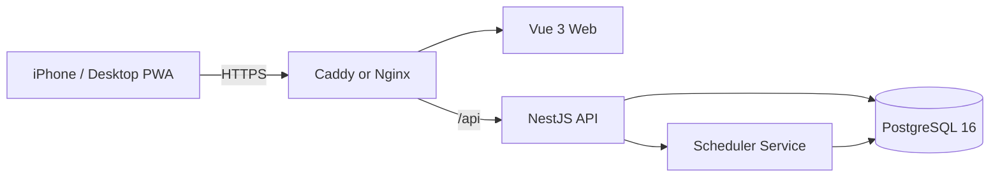

# Speaking Core 1350 - Implementation Specification v2.0

## 1. Goal
Speaking Core 1350 is a mobile-first PWA for converting high-value English vocabulary, phrasal verbs, conversation chunks and work expressions into active speaking vocabulary. The server version replaces browser-only progress storage with account-based synchronization.

## 2. Dataset
- Conversation Chunk: 300
- Phrasal Verb: 150
- Core Word: 700
- Work English: 200
- Total: 1,350

`data/speaking_core_1350_seed_v2.json` is the canonical content source. IDs must remain stable. The list is a curated speaking-priority curriculum, not a claim of exact absolute corpus-frequency ranking. The schema keeps `rank` so a later corpus-based ranking revision does not require identity changes.

## 3. Product scope
- Google OAuth 2.0 / OpenID Connect login/logout (no password accounts, no other providers)
- Cross-device progress synchronization
- Daily 30 queue (due first, unseen second)
- Due-only, new-only, weak-item modes
- Search and category filters
- English TTS
- Korean-to-English recall mode
- Four review ratings: Again, Hard, Good, Easy
- Progress dashboard and category breakdown
- PWA installability
- Docker Compose deployment on Hetzner

## 4. Architecture

## 5. Backend modules
- AuthModule: Google OAuth login start/callback, current session, logout
- UsersModule: profile/timezone
- LearningItemsModule: read-only content queries
- StudyModule: queue generation, sessions, reviews, scheduler
- ProgressModule: summary, calendar, category statistics
- HealthModule: readiness/liveness

## 6. Data model
Use `database/schema.prisma` as the initial contract. Learning item content is immutable during normal study. Content administration can be deferred.

## 7. API
- GET `/api/auth/google` (start Google OAuth flow)
- GET `/api/auth/google/callback` (Google redirects here; sets session cookie)
- GET `/api/auth/me`
- POST `/api/auth/logout`
- GET `/api/learning-items`
- GET `/api/learning-items/:id`
- GET `/api/study/daily?limit=30`
- GET `/api/study/due`
- GET `/api/study/new`
- GET `/api/study/weak`
- POST `/api/study/sessions`
- POST `/api/study/reviews`
- PATCH `/api/study/sessions/:id/finish`
- GET `/api/progress/summary`
- GET `/api/progress/calendar`
- GET `/api/health`

## 8. Review scheduling
Scheduling is calculated only by the backend. See `CLAUDE.md` for exact v1 formulas. A review write must atomically create StudyReview and update LearningProgress.

## 9. Mobile UX
The primary learning screen must fit an iPhone viewport without horizontal scrolling. Large bottom rating buttons, TTS, reveal, previous/next and typed recall are first-class. Dark mode is the default.

## 10. Security
- Google OAuth 2.0 / OIDC only; no passwords stored anywhere
- Google `sub` (not email) is the canonical external identity key, enforced with a unique DB constraint
- Google ID token / authorization code verified server-side (never trust Frontend-supplied identity claims)
- Application session is a Secure, HttpOnly, SameSite cookie holding a backend-signed session token; no access token in `localStorage`
- CORS restricted to configured frontend origin
- Helmet/rate limiting appropriate for a small public service
- No secrets in repository

## 11. Deployment
Use `deploy/docker-compose.prod.yml`, `.env.example`, and `deploy/Caddyfile.example` as the deployment starting point. PostgreSQL must use a named volume. Backups must be documented.

## 12. Acceptance criteria
1. Seed count 1,350 and category counts 300/150/700/200 are verified automatically.
2. The same account sees the same progress on phone and desktop.
3. Daily queue prioritizes due cards and contains no duplicates.
4. Ratings update due dates server-side and persist after login/restart.
5. PWA is installable on iPhone Safari.
6. Production Compose startup and health checks succeed.
7. Scheduler and core API tests pass.
